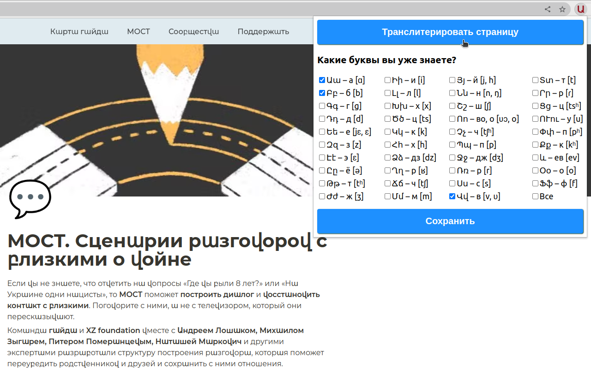

# Learn Armenian Alphabet

Learn Armenian Alphabet is a simple Google Chrome extension for memorizing the Armenian alphabet by replacing Russian letters with Armenian.

**[Try it](https://chrome.google.com/webstore/detail/learn-armenian-alphabet/pgaijcphdccnckpinelaldfmbpdnfofo)**

### Usage

- Check the letters whose sounds you already know
- Click the 'Save' button to save checked letters
- Click the 'Transliterate' button to transliterate the page

